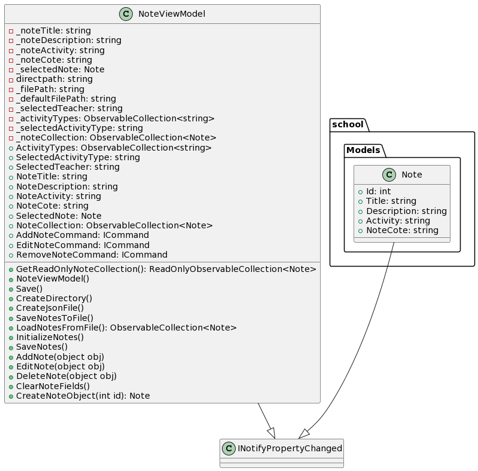
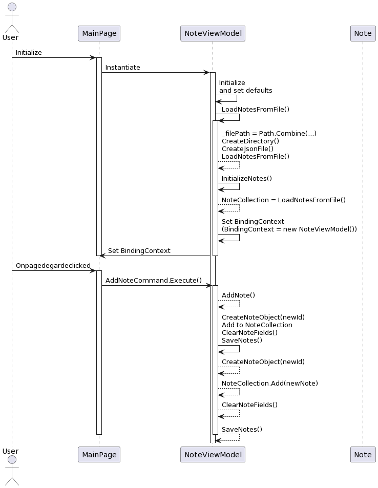

# Programmation orientée objet Projet Ecole

## Description
ce projet vise à améliorer l'exercice du labo 2 en intégrant une interface moderne grâce à MAUI (Multi-platform App UI). Notre objectif principal est de simplifier la gestion des données liées à un établissement éducatif en permettant la création d'enseignants, d'activités, d'étudiants, et en facilitant la gestion des évaluations. En outre, nous cherchons à offrir une expérience utilisateur fluide en connectant les activités aux enseignants et en générant des bulletins détaillés pour les étudiants.

Les principales fonctionnalités de cette interface MAUI comprennent la création d'enseignants, la définition d'activités éducatives, l'association d'activités à des enseignants, la gestion d'étudiants, l'ajout d'évaluations (sous forme de cotes ou d'appréciations) pour des cours spécifiques, et enfin, l'affichage du bulletin complet des étudiants.

En réponse à la demande spécifique du projet, nous avons choisi d'ajouter une fonctionnalité supplémentaire particulièrement pertinente : la possibilité de laisser des commentaires généraux. Cette fonctionnalité permettra aux utilisateurs d'ajouter des remarques globales et des observations sur les enseignants, les activités ou les étudiants, contribuant ainsi à une communication plus riche et à une compréhension approfondie des performances éducatives.

## Quelques images de notre application

## Diagramme UML
### 1.  Diagramme de classes

  

### 2.  Diagramme de séquences

  

## Principes SOLID

En ce qui concerne les principes SOLID, nous pouvons aborder le respect du principe de responsabilité unique et du principe ouvert/fermé.

### 1. open/closed principle (OCP)
Le principe Ouvert/Fermé stipule qu'une classe devrait être ouverte à l'extension mais fermée à la modification. Il est facile d'ajouter de nouvelles méthodes dans la classe principale pour étendre les fonctionnalités sans avoir à modifier le code existant. La modification du code existant est rendue complexe, voire quasi impossible à l'extérieur de la classe, en raison de l'utilisation d'attributs privés pour toutes les variables d'instances et du respect de l'encapsulation à tous les niveaux. Ainsi, le principe ouvert/fermé est également suivi, favorisant la flexibilité et la robustesse du système.

### 2. Inversion de Dépendance (DIP)
Le principe de l'Inversion de Dépendance (DIP) stipule que les modules de haut niveau ne devraient pas dépendre des modules de bas niveau, mais plutôt des abstractions. Dans notre cas, avec la classe mère INotifyPropertyChanged et les classes filles Note et NoteViewModel, nous pouvons analyser comment ce principe est respecté. 

1. **Classe Mère : INotifyPropertyChanged**

La classe mère INotifyPropertyChanged est une interface standard dans le développement logiciel, souvent utilisée dans le contexte de la liaison de données. Elle définit un mécanisme pour signaler aux clients que la valeur d'une propriété a été modifiée.

2. **Classes Filles : Note et NoteViewModel**

La classe **Note** peut être considérée comme une classe de bas niveau dans ce contexte. Elle incarne une représentation simple d'une note ou d'une évaluation au sein du système éducatif. Elle est chargée d'implémenter des propriétés spécifiques à la note. 

La classe **NoteViewModel** est principalement utilisée pour modéliser les données d'une note au niveau de l'interface utilisateur. Elle peut contenir des propriétés supplémentaires ou calculées nécessaires à l'affichage dans l'interface graphique. Cette classe agit comme un intermédiaire entre les données brutes de la note (Note) et l'interface utilisateur, fournissant ainsi une structure appropriée pour la gestion des interactions entre la logique métier et la présentation visuelle.

## Modèle MVC (Modèle-Vue-Contrôleur)

Dans le contexte du projet, nous pouvons analyser comment le modèle MVC est représenté en se basant sur les classes **Note** et **NoteViewModel**.

### Modèle (Model) - Note 

La classe Note agit comme le modèle dans le modèle MVC. Elle représente les données liées à une note ou à une évaluation dans le système éducatif. Cette classe détient les propriétés spécifiques à une note telles que le titre, la description, l'activité associée et la note attribuée.

### Contrôleur (Controller) - NoteViewModel 

Dans le contexte de cette implémentation, la classe NoteViewModel remplit le rôle de contrôleur dans le modèle MVC. Elle contient la logique métier, gère les interactions utilisateur, traite les commandes, et met à jour le modèle en conséquence. La classe NoteViewModel est responsable de la coordination entre la vue (NoteView.xaml) et le modèle (Note).

En résumé, notre approche dans la conception du programme témoigne du respect des principes SOLID, en particulier du principe de responsabilité unique et du principe ouvert/fermé, assurant ainsi un code structuré, évolutif et maintenable.
